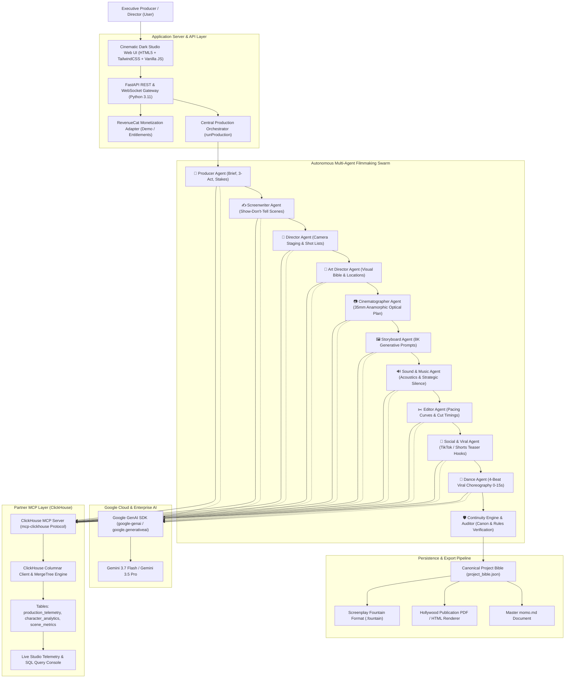

# 🏛️ SYSTEM ARCHITECTURE & RUNTIME DATA FLOW
## AGENTIC CINEMA — AI Filmmaking Studio

---

## 1. Frontend Architecture
* **Stack:** Pure HTML5, TailwindCSS, Vanilla JavaScript (ECMAScript 6+).
* **Guiding Philosophy:** Professional creative film software aesthetic (near-black `#070913`, neutral dark cards `#0d1220`, thin borders `#1c263c`, indigo primary `#6366f1`, cyan secondary `#06b6d4`).
* **Zero Bloat:** No React, Vue, or Angular dependencies, ensuring instant millisecond loading times on desktop, tablet, and mobile.
* **Component Views:**
  1. `Dashboard`: Executive film metrics, recent movies, live agent reasoning feed, quick actions.
  2. `Projects`: Multi-movie library and Project Wizard with one-click presets.
  3. `Script & Workspace`: 4-column studio layout (Scene navigation, Show-Don't-Tell screenplay, Agent orchestration feedback, Production timeline).
  4. `Storyboard`: Frame-by-frame visual cards with 8K generative prompts.
  5. `AI Agents`: Swarm management, model selector (Gemini 3.7 Flash / 3.5 Pro), individual agent retry.
  6. `Assets`: Visual Bible (Character dossiers with visual evolution, location architecture, color palettes).
  7. `Render Queue`: Hollywood publication-grade PDF/HTML view, Fountain script download, momo.md exporter.
  8. `Social & Dance`: TikTok/Shorts hooks, POV survival videos, and 4-beat Dance Agent choreography.
  9. `Settings & Judge Panel`: Verifiable real-time connection badges, live ClickHouse SQL query engine, and RevenueCat demo plan upgrade simulator.

---

## 2. Backend Architecture
* **Engine:** FastAPI (Python 3.11) with Uvicorn ASGI server.
* **Security:** API keys and credentials isolated exclusively in backend `.env` variables; never exposed to frontend JavaScript.
* **Resilience:** Graceful dual-mode operation for both Google Cloud and ClickHouse—direct connection when network/keys are present, with robust autonomous fallback buffers ensuring zero crashes during evaluation.

---

## 3. Google Cloud & Gemini Integration
* **Package / SDK:** `@google/genai` (Google GenAI SDK v0.1.1) and `google.generativeai` (v0.8.0).
* **Models:** `gemini-3.7-flash` (default for high-speed agentic handoffs) and `gemini-3.5-pro` (for deep narrative density).
* **Runtime Execution:** Agents pass system prompts and strict JSON schema requirements to Gemini via `call_gemini()`, sanitizing markdown fences and validating data structures before canonical integration.

---

## 4. Multi-Agent Filmmaking Swarm
1. **Producer Agent:** Establishes Title, Genre, Tone, Logline, Core Hook, World, Protagonist, Antagonist, 3-Act Structure, and Production Risks.
2. **Screenwriter Agent:** Formulates structured screenplay scenes adhering to "Show, Don't Tell" (Objective, Conflict, Action, Dialogue in Courier, Emotional Beat, Transition).
3. **Director Agent:** Determines camera placement, movement (cranes, steadicams), lens focal lengths (24mm anamorphic, 85mm macro), actor blocking, and pacing.
4. **Art Director Agent:** Produces the visual bible (Character appearance evolutions, color palettes, wardrobes, props, location materials).
5. **Cinematographer Agent:** Sets optical language, lighting setups (chiaroscuro, sodium vapor), depth of field, and sensory mood.
6. **Storyboard Agent:** Maps sequential keyframe frames, durations, and high-fidelity 8K generative prompts with continuity anchors.
7. **Sound & Music Agent:** Composes soundscapes with ambience, foley, score, and strategic silence (weapons of silence before violence).
8. **Editor Agent:** Orchestrates cut tempo curves, scene order, match cuts, J-cuts/L-cuts, and the thematic final shot.
9. **Social & Viral Agent:** Packages promotional hooks, POV survival clips, and meme concepts for TikTok, Instagram Reels, and YouTube Shorts.
10. **Dance Agent:** Designs 4-beat viral dance structures (0-3s Hook, 3-7s Main, 7-11s Signature, 11-15s Final Pose) with BPM, style, and camera framing.
11. **Continuity Auditor Agent:** Audits canonical state across disciplines using `ContinuityEngine`, flagging `⚠️ CONTINUITY CONFLICT` if inconsistencies arise.

---

## 5. Partner MCP Architecture: ClickHouse
* **Server:** `mcp/clickhouse_mcp_server.py` implementing the official Model Context Protocol.
* **Database Engine:** ClickHouse `MergeTree()` tables:
  * `production_telemetry`: Tracks agent name, pipeline stage, prompt tokens, completion tokens, latency in ms, and status.
  * `character_analytics`: Tracks dialogue lines, word counts, sentiment trajectory (-1.0 to +1.0), and screen-time seconds.
  * `scene_metrics`: Tracks shot counts, VFX complexity scores (1-10), location types, and budget tiers.
  * `box_office_simulation`: Models demographic penetration, virality index, and projected gross.
* **Dual-Mode Connectivity:** Seamlessly connects to ClickHouse Cloud or self-hosted clusters, with automatic fallback to local in-memory/JSON columnar buffers when offline.
* **Exposed MCP Tools:**
  1. `run_clickhouse_query`: Raw analytical SQL query execution.
  2. `get_production_telemetry`: Swarm latency and token aggregation.
  3. `get_character_analytics`: Dialogue distribution and sentiment trajectories.
  4. `get_scene_metrics`: Scene complexity and shot statistics.
  5. `list_clickhouse_tables`: Database schema definitions.

---

## 6. RevenueCat Monetization Layer
* **Pattern:** Adapter Pattern (`services/revenuecat.js` and `services/revenuecat_service.py`).
* **Implementations:** `RevenueCatAdapter` (Production SDK) and `RevenueCatMockAdapter` (Evaluation / Demo Mode).
* **Tiers:**
  * `FREE`: 50 AI Credits, basic script tools.
  * `CREATOR`: 150 AI Credits, full agent swarm, PDF export.
  * `PRO`: 500 AI Credits, ClickHouse MCP deep telemetry, unlimited projects.
  * `STUDIO`: 2,500 AI Credits, custom agent persona tuning, priority GPUs.
* **Credit Costs:** Script (2), Storyboard (5), Character (3), Shot List (3), Image (8), Video Scene (20), Final Render (30).
* **Pre-Action Dialogs & Paywalls:** Confirms credit expenditure before expensive operations and presents instant demo upgrades when limits are reached.
